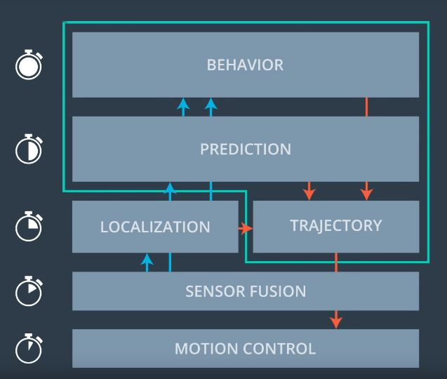
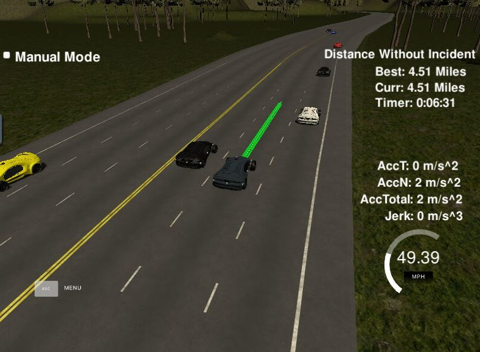
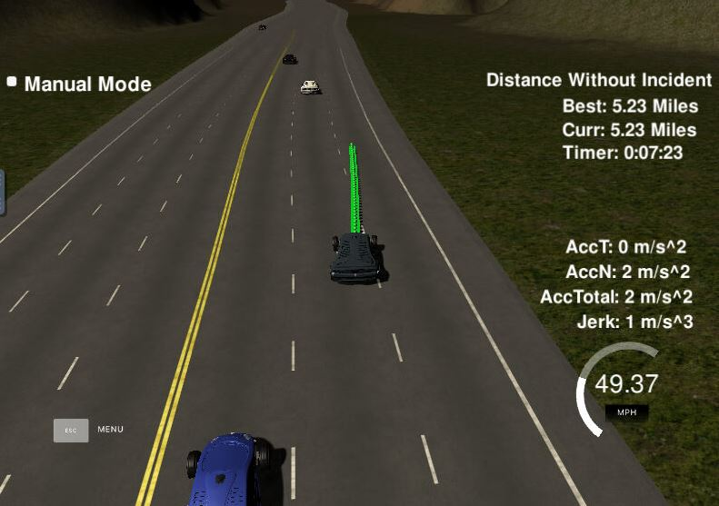

**Path planning project reflection**
Path planning is to generate safe and drivable path for a evhicle to get to the goal. It is a very complicated problem. 
The path planning for highway is simplified. It includes mainly three parts: 
*prediction of other objects around the ego vehicle, 
*behaviour planning to decide at a high level about what the car should do in the next 1 second, and 
*trajectory generation to create a smooth, drivable and collision free trajectory for the controller to follow.

The role of path planning in self driving car is shown in the following graph from Udacity class.



The corresponding code is within the main.cpp file.
```cpp
                      vector<double> predictions = get_predictions_from_sensor_fusion(sensor_fusion, prev_size, car_s, lane);

                      // Behaviour planning
                      bool car_left = predictions[0];
                      bool car_right = predictions[1];
                      bool car_front = predictions[2];
                      double front_speed = predictions[3];
                      
                      std::vector<std::pair<int, double>> successors = behaviour_planning(car_left, car_right, car_front, lane, ref_vel, front_speed);
                      // choose the least cost trajectory
                      double lowest_cost = 999999;
                      for(int i = 0; i < successors.size(); i++){

                        int successor_lane = successors[i].first;
                        double successor_ref_vel = successors[i].second;
                        // calculate cost
                        double cost = calculate_cost(lane, car_speed, successor_lane, successor_ref_vel);
                        // get the lowest cost and corresponding trajectory
                        if(cost < lowest_cost){
                          lowest_cost = cost;
                          lane = successor_lane;
                          ref_vel = successor_ref_vel;
                        }
                      }

                      // Trajectory generation
                      vector<vector<double>> best_trajectory = choose_next_trajectory(lane, ref_vel, car_x, car_y, car_yaw, car_s, car_d, 
                                                                                      map_waypoints_s, map_waypoints_x, map_waypoints_y,
                                                                                      previous_path_x, previous_path_y);
```
The **prediction** is based on the information of other vehicles from the sensor fusion in the helper.h file from line 162-190. It first filter the vehicles within 100m from the ego vehicle, then use the predicted neighbouring vehicles end locations based on the same direction and speed to see if there are vehicles in the front in the same lane, in the left lane and right lane.
```cpp     
     if(check_car_lane == lane){
        if((check_car_s > car_s) && (check_car_s < car_s + 30)){
          car_front = true;
          front_speed = check_car_speed; // m/s
        }
      } else {
        if((check_car_lane == lane - 1) && (check_car_s > car_s && (check_car_s - car_s) < 40 ||  check_car_s < car_s && (car_s - check_car_s ) < 30)|| lane == 0)
          car_left = true;
        if((check_car_lane == lane + 1) && (check_car_s > car_s && (check_car_s - car_s) < 40 ||  check_car_s < car_s && (car_s - check_car_s ) < 30)|| lane == 2)
          car_right = true;
      }
```

The **behaviour planning** is based on the predictions. When there is no car in the front in the same lane, it can drive at 49.5 mph. 
Otherwise it can choose to stay in the same lane, change to left or right if allowed. This can be done by a finite state machine (FSM).
I simply used a vector of chosen lane and reference velocity to represent the states "keep lane", "lane change to left" and "lane change to right". It will generate a list of choices.
```cpp
  if(car_front){
    successor_lanes_ref_vels.push_back(std::make_pair(lane, ref_vel - 5 * 0.02));
    if(!car_left)
      successor_lanes_ref_vels.push_back(std::make_pair(std::max(lane - 1, 0), std::min(49.5/2.24, ref_vel + 5 * 0.02)));
    if(!car_right)
      successor_lanes_ref_vels.push_back(std::make_pair(std::min(lane + 1, 2), std::min(49.5/2.24, ref_vel + 5 * 0.02)));
  }

  if(!car_front){
    successor_lanes_ref_vels.push_back(std::make_pair(lane, std::min(49.5/2.24, ref_vel + 8 * 0.02)));
  }
```  

  Then the **trajectory** shall be generated and the cost of the trajectory should be calculated and compared to find the least-cost trajectory. I followed the [Q&A guide video](https://www.youtube.com/watch?v=7sI3VHFPP0w&feature=youtu.be)  in the project and used the Spline to generate smooth trajectories. I calculated the cost for each choice between lines 211 and 236. In the calculation, I only considered the lane change, speed limit, and acceleration.

**Results**
The ego vehicle managed to drive safely for more than 4.32 miles and changed lane when condition allowed.



**To improve:**
* 1> Make use of the speed and distance from neighbouring vehicles to include cost of collision.
* 2> Consider giving a range of reference velocities to choose from instead of the max acceleration or deceleration one.
* 3> Take into account of the lane speed for the cost to avoid being blocked by slow cars in front and neighbouring lane.
* 4> The code is based on the provided project code which is not well designed and structured. Further improvement can be done to
  improve readibility, structure and extendability.

**Further readings**
I passed the project review and the reviewer recommended me to read more matterials in the following links.
http://correll.cs.colorado.edu/?p=965
https://www.cs.cmu.edu/afs/cs/project/jair/pub/volume9/mazer98a-html/node2.html
https://robotics.stackexchange.com/questions/8302/what-is-the-difference-between-path-planning-and-motion-planning
http://ais.informatik.uni-freiburg.de/teaching/ss11/robotics/slides/18-robot-motion-planning.pdf
http://ais.informatik.uni-freiburg.de/teaching/ss10/robotics/slides/16-pathplanning.pdf


